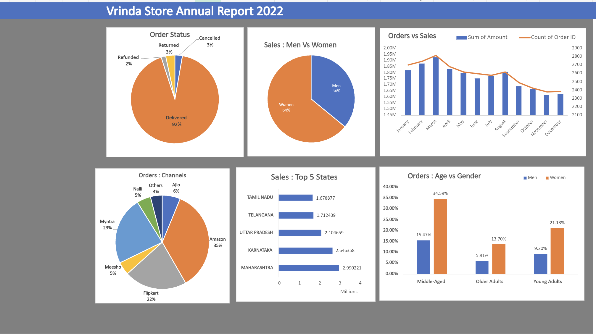

# 📊 Vrinda Store Annual Report Dashboard (Excel)

## 📌 Overview
This project is an interactive Excel dashboard analyzing Vrinda Store sales performance for 2022.

## 📊 Key Insights
- Women contribute ~64% of total sales
- Amazon is the top-performing channel (~35%)
- Maharashtra generates highest revenue (~2.99M)
- Majority orders are successfully delivered (~92%)

## 📈 Dashboard Features
- Sales vs Orders trend (monthly)
- Gender-wise sales distribution
- Order status breakdown
- Top 5 states by revenue
- Age group vs gender analysis
- Channel-wise order distribution

## 🛠 Tools Used
- Microsoft Excel
- Pivot Tables
- Pivot Charts
- Slicers

## 📷 Dashboard Preview

## 🎯 Business Use Case
Helps stakeholders understand:
- Customer demographics
- Sales performance trends
- Channel effectiveness
- Regional performance
